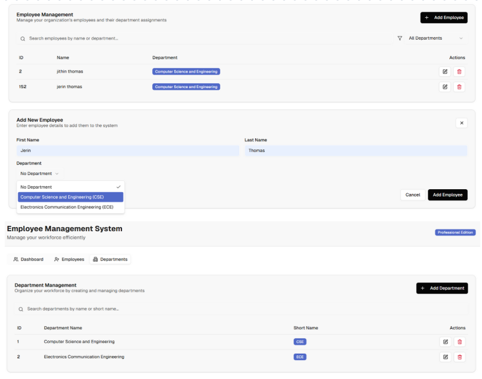

# Employee Management System

A full-stack web application to manage employees and departments.  
Built with **Spring Boot (Java) + MySQL** for the backend and **Next.js (React + TypeScript + TailwindCSS)** for the frontend.


---

## 🚀 Introduction

The **Employee Management System** helps organizations manage employees and departments efficiently.

**Admin capabilities:**
- Add, update, delete, and view employees
- Add, update, delete, and view departments
- View total count of employees and departments

---

## 🛠 Tech Stack

**Frontend**
- Next.js 14
- React 18
- TypeScript
- TailwindCSS
- Radix UI components

**Backend**
- Spring Boot
- JPA + Hibernate
- MySQL (Docker-ready)

---

## ✨ Features

- 🔐 CRUD operations for Employees and Departments
- 📊 Employee & Department count endpoints
- 🗄 MySQL integration (Docker-ready)
- 🎨 Modern UI with Tailwind + Radix UI
- 📱 Responsive design
- 🔄 API integration between Next.js frontend and Spring Boot backend


---

## ⚙️ Installation

### 🔧 Backend Setup

```bash
cd employee-management-backend
./gradlew bootRun
```

Backend runs at `http://localhost:8080`

### 🎨 Frontend Setup

```bash
cd employee-management-frontend
npm install
npm run dev
```

Frontend runs at `http://localhost:3000`

### 🗄 Database Setup

**Docker Compose (recommended)**

```bash
cd employee-management-backend
docker compose up -d
```

**Or Local MySQL:** Create database `employee_management`, update credentials in `application.properties`.

---

## ▶️ Usage

1. Start MySQL service
2. Run backend (`./gradlew bootRun`)
3. Run frontend (`npm run dev`)
4. Visit `http://localhost:3000`

---

## 📡 API Endpoints

### Employees

| Method | Endpoint | Description |
|--------|----------|-------------|
| `GET` | `/employees` | List all employees |
| `GET` | `/employees/{id}` | Get employee by ID |
| `GET` | `/employees/count` | Get total number of employees |
| `POST` | `/employees` | Add employee |
| `PUT` | `/employees/{id}` | Update employee |
| `DELETE` | `/employees/{id}` | Delete employee |

### Departments

| Method | Endpoint | Description |
|--------|----------|-------------|
| `GET` | `/departments` | List all departments |
| `GET` | `/departments/{id}` | Get department by ID |
| `GET` | `/departments/count` | Get total number of departments |
| `POST` | `/departments` | Add department |
| `PUT` | `/departments/{id}` | Update department |
| `DELETE` | `/departments/{id}` | Delete department |

---

## 📝 Examples

### 🔹 Add Department

```http
POST /departments
Content-Type: application/json

{
  "name": "Human Resources",
  "location": "Head Office"
}
```

### 🔹 Update Department

```http
PUT /departments/1
Content-Type: application/json

{
  "name": "HR & Recruitment",
  "location": "Building A"
}
```

### 🔹 Add Employee

```http
POST /employees
Content-Type: application/json

{
  "firstName": "John",
  "lastName": "Doe",
  "email": "john.doe@example.com",
  "salary": 55000,
  "departmentId": 1
}
```

### 🔹 Update Employee

```http
PUT /employees/2
Content-Type: application/json

{
  "firstName": "Jane",
  "lastName": "Smith",
  "email": "jane.smith@example.com",
  "salary": 60000,
  "departmentId": 1
}
```

### 🔹 Delete Employee

```http
DELETE /employees/2
```

### 🔹 Get Counts

- `GET /employees/count` → returns total number of employees
- `GET /departments/count` → returns total number of departments

---

## ⚙️ Configuration

Backend configuration in `employee-management-backend/src/main/resources/application.properties`:

```properties
spring.datasource.url=jdbc:mysql://localhost:3306/employee_management
spring.datasource.username=jerin
spring.datasource.password=jerin@123
spring.jpa.hibernate.ddl-auto=update
spring.jpa.show-sql=true
```

---

## 🐞 Troubleshooting

- **Frontend not connecting** → Check backend is running at `http://localhost:8080`
- **MySQL errors** → Ensure DB is running & credentials are correct
- **Port conflicts** → Backend: 8080, Frontend: 3000, MySQL: 3306

---

## 👥 Contributors

- **You** 🎉 (Developer of this project)

---

## 📜 License

This project is licensed under the MIT License.